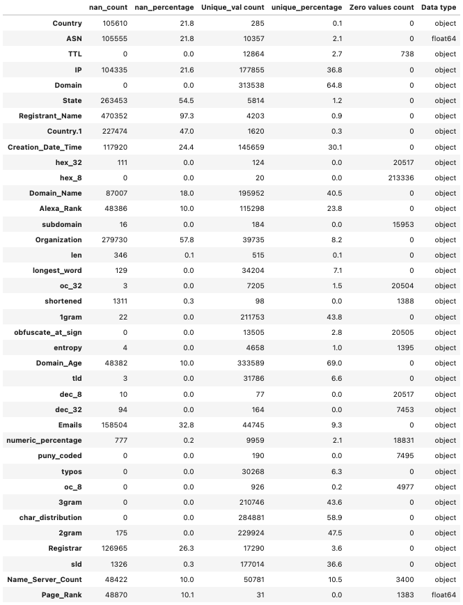
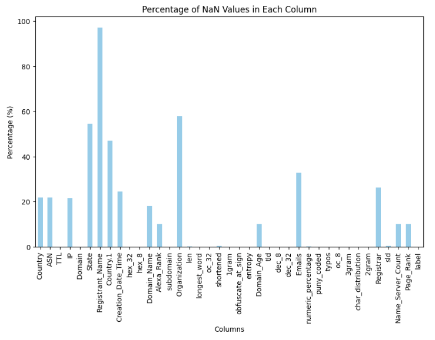
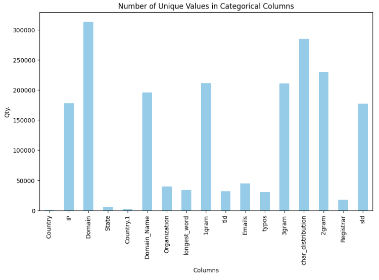
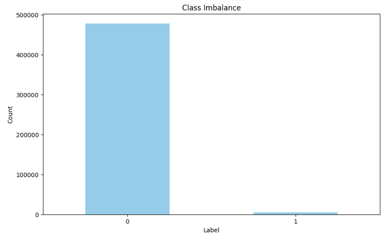
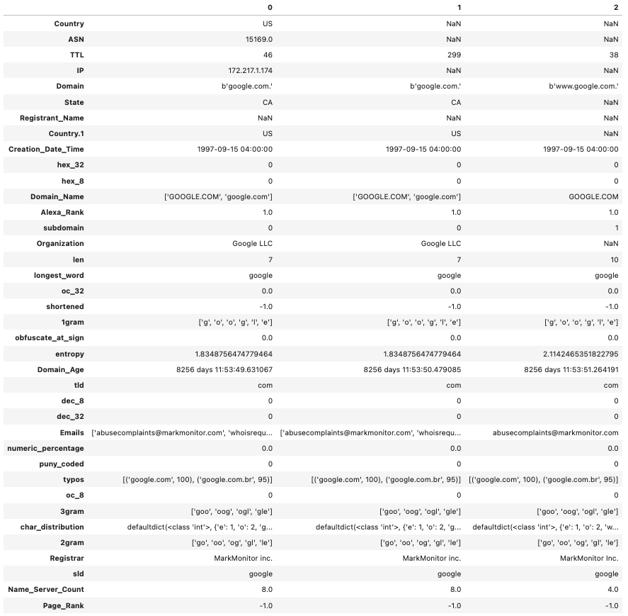
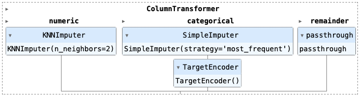
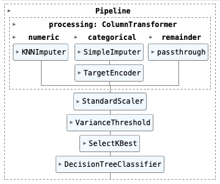
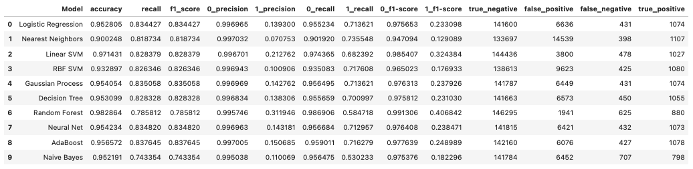

Data Science - Klasyfikacja

## Tutuł Projektu

**Klasyfikacja domen nieszkodliwych i złośliwych**

## Opis

Ten projekt ma na celu rozwinięcie modelu uczenia maszynowego do klasyfikacji domen internetowych na dwie kategorie: "Benign" (nieszkodliwe) i "Malicious" (złośliwe). Internet jest domem dla ogromnej liczby domen, dlatego istotne jest identyfikowanie potencjalnie szkodliwych domen w celu zwiększenia bezpieczeństwa w sieci i ochrony użytkowników przed zagrożeniami.

Projekt wykorzystuje różne techniki z dziedziny data science, aby stworzyć system klasyfikacji, który automatycznie rozróżnia benign domeny (bezpieczne i godne zaufania) od domen złośliwych (związanych z działaniami takimi jak phishing, malware lub innymi ryzykami związanymi z bezpieczeństwem).

## Spis treści

- Struktura Projektu
- Instalacja
- Dane
- Eksploracja i analiza danych
- Metody i modele
- Metryki wydajności i interpretacja
- Nowe dane
- Kolejne kroki

## Struktura projektu

- `Data/`: Zawiera pliki z danymi.
- `Images/`: Notatniki Jupyter do eksploracji i analizy danych.
- `environment.yaml`: Plik środowiskowy.
- `1_Data_Preparation.ipynb.ipynb` - notatnik do czyszczenia danych
- `2_Classification_Models.ipynb` - notatnik do trenowania modeli i wyników
- `Readme.md` - Plik Readme


## Instalacja

Aby zapewnić spójność i możliwość odtworzenia, korzystamy z narzędzia Conda do zarządzania środowiskiem projektu. Plik `environment.yaml` zawiera wszystkie zależności wymagane do tego projektu. Postępuj zgodnie z poniższymi krokami, aby skonfigurować środowisko:

1. **Sklonuj Repozytorium:**
   ```bash
   git clone https://github.com/szafranskifilip/ML_Academy.git
   cd projectlocation
```


2. **Utwórz Środowisko Conda**:
   ```bash
conda env create -f environment.yaml
```


3. **Aktywuj Środowisko**:
   ```bash
   conda activate domain-classifier
```


4. **Zainstaluj Biblioteki**:
```bash
pip install scikit-learn
pip install imblearn
```


## Dane

Źródło: Zestaw danych znany jako CIC-Bell-DNS2021 to zbiór cech DNS (Domain Name System) wydobytych z domen zarówno nieszkodliwych, jak i złośliwych. Domeny wykorzystane w tym zbiorze zostały zebrane z różnych źródeł i sklasyfikowane jako nieszkodliwe, spam, phishing i złośliwe.

Zawartość Zestawu Danych

Domeny Nieszkodliwe i Złośliwe: Zestaw danych zawiera łącznie 478 613 domen nieszkodliwych i 4 977 domen złośliwych. Te domeny zostały przetworzone z większego zestawu danych, który zawierał jedno milion domen nieszkodliwych i 51 453 znane domeny złośliwe pochodzące z publicznie dostępnych zestawów danych.

Nierównowaga klas: 1:95

Format

Zestaw danych dostarczony jest w formacie csv, który obejmuje cechy wydobyte z ruchu DNS tych domen. Cechy te zawierają różne statystyczne cechy DNS, cechy leksykalne oraz cechy oparte na źródłach zewnętrznych (np. informacje Whois i ranking Alexa). Dane są zorganizowane w formie tabelarycznej, w pliku CSV, gdzie każdy wiersz reprezentuje domenę, a kolumny reprezentują wydobyte cechy. Zestaw danych składa się z 39 kolumn.

## Eksploracja danych i analiza

#### Podsumowanie danych - Wartości NaN i unikalne

Podsumowanie zestawu danych zawierające informacje na temat wartości NaN i unikalnych wartości oraz ich procentowego udziału. Pomaga to zidentyfikować np. kolumny z znaczną liczbą wartości NaN, które można usunąć, lub metody kodowania danych kategorycznych (niska vs. wysoka kardynalność). Na podstawie poniższego podsumowania można zauważyć, że większość danych kategorycznych charakteryzuje się wysoką kardynalnością. Istnieje również kolumna, w której liczba wartości NaN przekracza 90%, i zostanie ona usunięta.








#### Data Summary - Class Imbalance



#### Czyszczenie danych

Dataset Preview



Powyżej widzimy początkowy kształt danych po połączeniu dwóch plików CSV i przypisaniu etykiet.

Poniżej przedstawiamy kilka kroków **czyszczenia danych**, które zostały podjęte w celu przygotowania danych do przeprowadzenia procesu.

1. Usuń zduplikowane wiersze, jeśli liczba wartości NaN przekracza 75%


```python 
# Set the threshold for missing data (75%)
threshold = 0.25 * len(df_concat)
# Drop columns with missing data exceeding the threshold
df_concat = df_concat.dropna(thresh=threshold, axis=1)
```

2. Konwertuj 'Creation_Date_Time' na odpowiedni format daty. Parametr errors można ustawić na 'coerce', co zmusza do ustawienia wszelkich błędów parsowania jako NaT (Not a Timestamp). Następnie utwórz dwie kolumny numeryczne zawierające rok i miesiąc. Usuń 'Creation_Date_Time'.


```python 
df_concat['Creation_Date_Time'] = pd.to_datetime(df_concat['Creation_Date_Time'], errors='coerce')

# Create 'Year' and 'Month' columns
df_concat['Year'] = df_concat['Creation_Date_Time'].dt.year
df_concat['Month'] = df_concat['Creation_Date_Time'].dt.month

# Drop datetime column
df_concat = df_concat.drop(columns=['Creation_Date_Time'])
```

3. Użyj wyrażeń regularnych (RegEx), aby wyodrębnić wiek domeny w dniach i przekształcić go na typ numeryczny.

```python
# Use regex to extract the number of days from Domain_Age column
df_concat['Domain_Age'] = df_concat['Domain_Age'].str.extract(r'(\d+) days').astype(float)
```

4. Zidentyfikuj kolumny o typie danych 'object,' które można przekształcić na liczby. To podział będzie konieczny do dalszych przekształceń danych w procesie przetwarzania.

```python 
# Determine which columns can be converted to numeric data type
numerical_columns = ['TTL','hex_32','hex_8', 'Alexa_Rank', 'subdomain', 'len', 'oc_32', 'shortened', 'entropy', 'obfuscate_at_sign', 'ASN', 'dec_8', 'dec_32', 'numeric_percentage', 'puny_coded', 'oc_8', 'Name_Server_Count', 'Page_Rank', 'Year', 'Month', 'label', 'Domain_Age']

# Convert to numeric data type
df_concat[numerical_columns] = df_concat[numerical_columns].apply(pd.to_numeric, errors='coerce')

# Determine which columns are categorical data type by dropping numeric columns
categorical_columns = df_concat.drop(columns=numerical_columns).columns

```

5. Usuń wartości inf - ważnym krokiem jest identyfikacja i konwersja wartości inf.

```python 
df_concat.isin([np.inf, -np.inf]).any().any()
True
df_concat = df_concat.replace([np.inf, -np.inf], np.nan)
```

6. Zapisz przygotowany zestaw danych do pliku pickle.

## Metody i modele

#### Podział danych

W tym projekcie wykorzystaliśmy biblioteki Scikit-Learn oraz imbalanced-learn (imblearn) do zarządzania naszym zestawem danych w procesie klasyfikacji.

Podzieliliśmy nasz zestaw danych na zbiory treningowe i testowe w celu oceny wydajności naszych modeli uczenia maszynowego. Wykorzystaliśmy powszechnie akceptowany podział 70/30, gdzie 70% danych zostało przeznaczone na zbiór treningowy, a 30% na zbiór testowy. W tym celu skorzystaliśmy z funkcji train_test_split dostępnej w bibliotece Scikit-Learn.

#### Rozwiązywanie problemu nierównowagi klas

W naszym zestawie danych napotkaliśmy problem nierównowagi klas, z rozkładem w stosunku 1:95 między klasą mniejszościową a klasą większościową. Aby poradzić sobie z tą nierównowagą, skorzystaliśmy z biblioteki imbalanced-learn (imblearn). Biblioteka ta dostarcza różne techniki samplingu w celu zapewnienia, że nasze modele nie będą nadmiernie preferować klasy większościowej. Poniżej, jak poradziliśmy sobie z nierównowagą klas:

- Zaimporotowaliśmy niezbędne moduły z imblearn, takie jak RandomUnderSampler.
- Zastosowaliśmy RandomUnderSampler, aby zmniejszyć sampling klasy większościowej, jednocześnie zachowując wszystkie instancje klasy mniejszościowej. Przyjęliśmy wartość Sampling_strategy=0.8.

Ta technika próbkowania pomogła stworzyć zrównoważony zbiór treningowy, z którego modele mogły efektywnie się uczyć.

#### Cross-Validation w celu oceny modelu
W późniejszych etapach projektu można wdrożyć techniki walidacji krzyżowej, aby dokładniej ocenić wydajność naszego modelu. Walidacja krzyżowa polega na podziale danych na wiele podzbiorów i trenowaniu/ocenie modelu na różnych kombinacjach. Ta metoda dostarcza bardziej solidną ocenę zdolności modelu do generalizacji na dane niewidziane i pomaga zapewnić, że nasze wyniki nie zależą nadmiernie od pierwotnego podziału na zbiór treningowy i testowy.

#### Transformacja danych i pipelines

W projekcie klasyfikacji domen, efektywna obróbka danych jest kluczowa dla budowy solidnego i dokładnego modelu klasyfikacji do rozróżniania domen nieszkodliwych i złośliwych. W tym celu opracowaliśmy kompleksowy proces przetwarzania danych, wykorzystując pipelines w scikit-learn.

**1. Pipelines transformacja Danych**

Rozpoczynamy od rozważenia różnych typów danych obecnych w naszym zestawie danych, w szczególności danych liczbowych i kategorycznych. Te pipelines są zaprojektowane do obsługi imputacji, kodowania i przekształceń danych:

**a. Pipeline transformacji danych liczbowych:**

Imputation: Brakujące wartości w cechach liczbowych są obsługiwane za pomocą imputera K-Nearest Neighbors (KNN). Ta technika wykorzystuje bliskość punktów danych do dokładnego oszacowania brakujących wartości.

**b. Pipeline transformacji danych kategorycznych:**

- **Imputation**: Brakujące wartości w cechach kategorycznych są uzupełniane za pomocą metody SimpleImputer, zapewniając, że brakujące dane nie prowadzą do utraty istotnych informacji.
- **High Cardinality Encoding**: Dane kategoryczne o dużej kardynalności są efektywnie kodowane za pomocą TargetEncodera. Ta technika przekształca zmienne kategoryczne w reprezentacje numeryczne, które uwzględniają zależność między kategoriami a zmienną docelową.

Wykorzystujemy `ColumnTransformer`, aby połączyć przekształcenia zarówno liczbowe, jak i kategoryczne w jedny procesor, co pozwala na bezproblemową integrację tych przekształceń w nasz ogólny pipeline przetwarzania danych.


<br />



<br />

**2. Główny Pipeline Przetwarzania Danych**
Główny pipeline przetwarzania danych łączy kroki wstępnego przetwarzania z dodatkowymi komponentami skalowania cech, selekcji i klasyfikacji:

- **Przetwarzanie**: Krok "przetwarzania" w pipline uwzględnia wcześniej zdefiniowane transformatory danych, zapewniając odpowiednie przekształcenie zarówno cech liczbowych, jak i kategorycznych.
- **Skalowanie**: Standardowe skalowanie jest stosowane za pomocą `StandardScaler()`, aby znormalizować cechy i doprowadzić je do tego samego zakresu, co jest istotne dla wielu algorytmów uczenia maszynowego.
- **Progi Wariancji**: Usuwanie cech o określonym progu wariancji przy użyciu `VarianceThreshold`. W naszym przypadku usunęliśmy cechy o zerowej wariancji.
- **Selekcja Cech**: Zastosowano podejście SelectKBest z `k=10`, aby zredukować wymiarowość przestrzeni cech. Ten krok identyfikuje najważniejsze cechy, które najbardziej przyczyniają się do zadania klasyfikacji.
- **Klasyfikator**: Ostatecznym krokiem w pipeline jest algorytm klasyfikacji, który zostanie wytrenowany na przetworzonych danych w celu rozróżnienia między domenami nieszkodliwymi i złośliwymi.


<br />



<br />


#### Modele

W projekcie eksplorowaliśmy i ocenialiśmy 10 różnych algorytmów klasyfikacji, aby określić najskuteczniejsze podejście do klasyfikowania domen jako nieszkodliwych lub złośliwych. Każdy model ma swoje unikalne cechy i zalety, które szczegółowo opisujemy poniżej:

1. **Regresja Logistyczna**: Model liniowy używany do klasyfikacji binarnej. Jest interpretowalny i efektywny.
2. **K-Nearest Neighbors (KNN)**: Metoda nieparametryczna, która klasyfikuje punkty danych na podstawie klasy większości wśród ich k najbliższych sąsiadów.
3. **Linear Support Vector Machine (SVC)**: Wykorzystuje liniową granicę decyzyjną do klasyfikacji danych.
4. **SVC with Radial Basis Function (RBF) Kernel**: Wykorzystuje nieliniowe jądro RBF do tworzenia złożonych granic decyzyjnych.
5. **Gaussian Process Classifier**: Model nieparametryczny i probabilistyczny.
6. **Decision Tree Classifier**: Buduje strukturę przypominającą drzewo, aby klasyfikować dane na podstawie podziałów cech.
7. **Random Forest Classifier**: Ensemble drzew decyzyjnych, który może radzić sobie ze złożonymi wzorcami.
8. **Klasyfikator Multi-layer Perceptron (MLP)**: Model głębokiego uczenia z wieloma warstwami, odpowiedni do złożonych zadań.
8. **Klasyfikator AdaBoost**: Łączy wiele słabych klasyfikatorów, aby stworzyć silny.
10. **Gaussian Naive Bayes (GaussianNB)**: Klasyfikator probabilistyczny oparty na twierdzeniu Bayesa.


## Metryki wydajności i interpretacja

Dla każdego z powyższych modeli zapisaliśmy metryki wydajności w dataframe.

Jeśli chodzi o wykrywanie złośliwych domen, najważniejsza metryka wydajności często zależy od konkretnych celów i priorytetów aplikacji. Niemniej jednak w wielu zadaniach związanych z bezpieczeństwem, zwłaszcza tam, gdzie konsekwencje pominięcia złośliwych domen mogą być poważne, współczynnik Recall jest zazwyczaj uważany za najważniejszą metrykę wydajności.

Oto dlaczego Współczynnik Recall często jest podkreślany w wykrywaniu złośliwych domen:

- **Minimalizacja False Negatives**: Fałszywe negatywy występują, gdy złośliwa domena jest błędnie klasyfikowana jako nieszkodliwa, co oznacza, że system nie wykrywa zagrożenia. W aplikacjach związanych z bezpieczeństwem, takich jak identyfikacja złośliwych domen, pominięcie zagrożeń może mieć poważne konsekwencje. Maksymalizacja Recall pomaga zmniejszyć liczbę fałszywych negatywów, co sprawia, że potencjalnie szkodliwe domeny są bardziej prawdopodobne do dalszego zbadania.
- **Trade-off z Precyzją**: Chociaż Recall jest kluczowy, często odbywa się to kosztem Precyzji. Precyzja mierzy zdolność do unikania fałszywych pozytywów, co oznacza, że nie błędne klasyfikowanie nieszkodliwych domen jako złośliwych. Jednak w aplikacjach związanych z bezpieczeństwem zazwyczaj bardziej akceptowalne jest posiadanie pewnej liczby fałszywych pozytywów (niższa Precyzja), jeśli oznacza to wykrycie jak największej liczby rzeczywistych zagrożeń (wyższy Recall).
- **System Wczesnego Ostrzegania**: Wysoki Recall zapewnia, że potencjalnie złośliwe domeny są identyfikowane nawet w przypadku lekkiego podejrzenia. Działa to jako system wczesnego ostrzegania, umożliwiając personelowi ds. bezpieczeństwa natychmiastowe dochodzenie i podjęcie działań.

Mając to na uwadze, wybór najważniejszej metryki wydajności wciąż może się różnić w zależności od konkretnych wymagań Twojej aplikacji i tolerancji na fałszywe alarmy (fałszywe pozytywy). Powszechne jest rozważenie równowagi między Recall a Precyzją, co odzwierciedla się w wyniku F1. Wynik F1 stanowi kompromis między nimi, ale jeśli konsekwencje pominięcia zagrożenia są szczególnie poważne, możesz dać pierwszeństwo Recall nad innymi metrykami.

<br /><br />

**Summary of models performance**



<br />

**Biorąc pod uwagę, że naszym celem jest minimalizacja fałszywych negatywów (FN) i maksymalizacja metryki Recall, najlepszym modelem po początkowym treningu jest 'AdaBoost', który osiągnął najwyższą metrykę Recall. Jednak po uwzględnieniu walidacji krzyżowej i dostrojeniu hiperparametrów wyniki mogą ulec zmianie, a inny model może wykazać lepszą wydajność.**

## Nowe dane

W każdym projekcie uczenia maszynowego zdolność do obsługi danych niewidzianych i nowych jest kluczowa, aby zapewnić rzeczywistą użyteczność i dostosowalność modelu do świata rzeczywistego. Pipeline projektu jest zaprojektowany tak, aby efektywnie radzić sobie z tym wyzwaniem.

**Przekształcenia i Przetwarzanie Danych**

Kroki przekształcenia i przetwarzania danych w naszym Pipeline są zaprojektowane w sposób elastyczny, aby obsługiwać wcześniej niewidziane lub nowe dane:

- **Imputacja danych**: Pipeline przekształceń danych liczbowych i kategorycznych uwzględniają techniki imputacji w celu obsługi brakujących wartości. Gdy pojawiają się nowe dane, metody imputacji dokładnie obsługują brakujące punkty danych, zapewniając, że dane pozostają odpowiednie do dalszego przetwarzania.
- **Feature Encoding**: Kodowanie danych kategorycznych, zwłaszcza za pomocą technik takich jak `TargetEncoder`, zapewnia, że nowe wartości kategoryczne można konsekwentnie przekształcać na reprezentacje numeryczne zgodne z danymi treningowymi. Dzięki temu model może efektywnie pracować z niewidzianymi kategoriami. Dodatkowo `TargetEncoder` traktuje brakujące wartości, takie jak `np.nan` lub `None`, jako inną kategorię i koduje je tak samo jak pozostałe kategorie. Kategorie, które nie zostały widziane podczas treningu, są kodowane za pomocą średniej wartości docelowej, tj. `target_mean_`.
- **Skalowanie i selekcja cech**: Kroki skalowania i selekcji cech są zgodne z danymi treningowymi, więc można je bezpośrednio zastosować do nowych danych bez konieczności modyfikacji.


**Adaptowalność modelu**
Nasze wybory algorytmów klasyfikacji i ogólna struktura Pipeline przyczyniają się do adaptowalności modelu do danych niewidzianych i nowych:

- **Selekcja Cech**: Korzystając z SelectKBest, zapewniamy, że w modelu używane są tylko najbardziej informatywne cechy. Pomaga to zmniejszyć wpływ nieistotnych lub zaszumionych cech w nowych danych, co sprawia, że model jest bardziej dostosowalny.
- **Ponowne Trenowanie**: Okresowe ponowne trenowanie modelu na nowych oznakowanych danych jest ważną częścią efektywnej obsługi nowych informacji. Pomaga to modelowi dostosować się do ewoluujących wzorców i utrzymać jego dokładność.
- **Ciągłe Monitorowanie i Ocena**: Aby zapewnić, że nasz Pipeline pozostaje skuteczny w obsłudze nowych danych, zalecamy wdrożenie procesów ciągłego monitorowania i oceny. Obejmuje to:

Regularne aktualizacje modelu na nowych oznakowanych danych, aby uwzględnić ewoluujące wzorce i zagrożenia.
Okresowe ponowne ocenianie wydajności modelu na nowych danych w celu zidentyfikowania ewentualnych zmian w dokładności. Utrzymanie pętli informacyjnej z analitykami ds. bezpieczeństwa lub ekspertami ds. domen, aby uwzględnić ich wglądy i wiedzę w aktualizacjach modelu.


## Kolejne kroki

W typowym projekcie z dziedziny nauk danych, po oczyszczeniu danych, przetwarzaniu, zbudowaniu pipeline i trenowaniu oraz ocenie modelu, istnieje kilka dodatkowych kroków i najlepszych praktyk, które są powszechnie podejmowane w celu zapewnienia sukcesu i niezawodności projektu. Te kroki mogą obejmować:

- **Selekcję i Inżynierię Cech**: Dalsze udoskonalenie i optymalizacja zestawu cech używanych w modelu. Może to obejmować tworzenie nowych cech, przekształcanie istniejących lub wybieranie najbardziej istotnych cech w celu poprawy wydajności modelu.
- **Dostrojenie Hiperparametrów**: Przeprowadzenie kompleksowego poszukiwania najlepszych hiperparametrów dla Twojego modelu. Techniki takie jak grid search pomogą znaleźć optymalne wartości hiperparametrów.
- **Interpretowalność Modelu**: Wdrożenie technik interpretacji modelu, takich jak wartości SHAP, LIME i metody interpretacji specyficzne dla modelu. Zrozumienie, dlaczego model podejmuje określone przewidywania, jest kluczowe dla budowania zaufania i uzyskiwania wglądów.
- **Cross-Validation**: Wdrożenie walidacji krzyżowej w celu oceny wydajności i stabilności modelu. Walidacja krzyżowa pomaga oszacować, jak dobrze model będzie działać na nowych, niewidzianych danych, oceniając go na wielu podzbiorach danych treningowych. Powszechne techniki to np. k-fold cross-validation.
- **Agregacja lub Grupowanie Danych Kategorycznych o Wysokiej Kardynalności**: Jeśli masz do czynienia z danymi kategorycznymi o wysokiej kardynalności, rozważ grupowanie lub agregowanie kategorii, które mają wspólne cechy. Może to pomóc zmniejszyć wymiar cech kategorycznych, zachowując jednocześnie znaczące informacje. Na przykład, możesz zgrupować rzadkie kategorie w kategorię "Inne".
- **Wdrożenie Modelu**: Przygotowanie modelu do wdrożenia w środowisku produkcyjnym. Może to obejmować konteneryzację, tworzenie interfejsów API RESTful lub wdrożenie modelu na platformach chmurowych.
- **Monitorowanie i Utrzymanie**: Wdrożenie systemu ciągłego monitorowania modelu w celu wykrywania degradacji modelu. Obejmuje to regularne ponowne trenowanie modelu na nowych danych i aktualizację go w miarę potrzeb.


